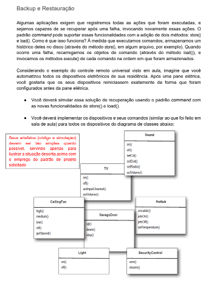

#Histórico de prompts

*A IA utilizada para a realização dessa atividade foi o Google Gemini na versão 3 Pro.*

**Prompt**:  
    considerando a imagem anexada, gere um passo a passo para a solução dessa questão, utilizando a linguagem java para a resposta 



**Resposta**:

Com base na imagem enviada, o problema pede a implementação do padrão de projeto **Command** com uma funcionalidade extra de **Persistência (Backup e Restauração)**. O objetivo é permitir que o sistema grave o histórico de comandos executados e, em caso de falha, recarregue e reexecute esses comandos para restaurar o estado dos dispositivos.

Abaixo, apresento um passo a passo da solução em **Java**, mantendo o código "tão simples quanto possível", conforme solicitado na nota em vermelho na imagem.

-----

### Passo 1: A Interface Command

Primeiro, definimos a interface do comando. Ela precisa estender `Serializable` para que possamos salvar os objetos (backup) em um arquivo.

```java
import java.io.Serializable;

// Interface comum para todos os comandos
public interface Command extends Serializable {
    void execute();
}
```

### Passo 2: Os "Receivers" (Dispositivos)

Implementamos as classes mostradas no diagrama. Para simplificar, os métodos apenas imprimirão mensagens no console, simulando a ação.
*Nota: As classes devem implementar `Serializable` porque os Comandos que serão salvos possuem referências a elas.*

```java
import java.io.Serializable;

class Light implements Serializable {
    public void on() { System.out.println("Light is ON"); }
    public void off() { System.out.println("Light is OFF"); }
}

class TV implements Serializable {
    public void on() { System.out.println("TV is ON"); }
    public void off() { System.out.println("TV is OFF"); }
    public void setInputChannel() { System.out.println("TV Channel set"); }
    public void setVolume() { System.out.println("TV Volume set"); }
}

class CeilingFan implements Serializable {
    public void high() { System.out.println("Fan is on HIGH"); }
    public void medium() { System.out.println("Fan is on MEDIUM"); }
    public void low() { System.out.println("Fan is on LOW"); }
    public void off() { System.out.println("Fan is OFF"); }
    public void getSpeed() { System.out.println("Getting Fan Speed..."); }
}

class GarageDoor implements Serializable {
    public void up() { System.out.println("Garage Door is UP"); }
    public void down() { System.out.println("Garage Door is DOWN"); }
    public void stop() { System.out.println("Garage Door STOPPED"); }
}

class Sound implements Serializable {
    public void on() { System.out.println("Sound system is ON"); }
    public void off() { System.out.println("Sound system is OFF"); }
    public void setCd() { System.out.println("Sound set to CD"); }
    public void setDvd() { System.out.println("Sound set to DVD"); }
    public void setRadio() { System.out.println("Sound set to Radio"); }
    public void setVolume() { System.out.println("Sound Volume set"); }
}

class HotTub implements Serializable {
    public void circulate() { System.out.println("HotTub is circulating"); }
    public void jetsOn() { System.out.println("HotTub Jets ON"); }
    public void jetsOff() { System.out.println("HotTub Jets OFF"); }
    public void setTemperature() { System.out.println("HotTub Temperature set"); }
}

class SecurityControl implements Serializable {
    public void arm() { System.out.println("Security System ARMED"); }
    public void disarm() { System.out.println("Security System DISARMED"); }
}
```

### Passo 3: Comandos Concretos

Aqui encapsulamos as ações. Implementarei dois exemplos principais para ilustrar. Em um cenário real, você criaria uma classe para cada ação de cada dispositivo (ex: `GarageUpCommand`, `TVOnCommand`, etc.).

```java
// Comando para ligar a Luz
class LightOnCommand implements Command {
    private Light light;

    public LightOnCommand(Light light) {
        this.light = light;
    }

    @Override
    public void execute() {
        light.on();
    }
}

// Comando para ligar o Ventilador no Alto
class CeilingFanHighCommand implements Command {
    private CeilingFan ceilingFan;

    public CeilingFanHighCommand(CeilingFan ceilingFan) {
        this.ceilingFan = ceilingFan;
    }

    @Override
    public void execute() {
        ceilingFan.high();
    }
}

// Comando para abrir a Garagem
class GarageDoorUpCommand implements Command {
    private GarageDoor garageDoor;
    
    public GarageDoorUpCommand(GarageDoor garageDoor) {
        this.garageDoor = garageDoor;
    }
    
    @Override
    public void execute() {
        garageDoor.up();
    }
}
```

### Passo 4: O Invoker (Controle Remoto com Histórico)

Esta é a parte central da questão. O controle remoto deve:

1.  Guardar um histórico de comandos executados.
2.  Implementar `store()` para salvar esse histórico em disco.
3.  Implementar `load()` para ler do disco e reexecutar tudo.

<!-- end list -->

```java
import java.io.*;
import java.util.ArrayList;
import java.util.List;

public class RemoteControl {
    private List<Command> history = new ArrayList<>();

    // Executa o comando e adiciona ao histórico
    public void buttonPressed(Command command) {
        command.execute();
        history.add(command);
    }

    // Método store(): Salva o histórico em arquivo
    public void store() {
        try (ObjectOutputStream out = new ObjectOutputStream(new FileOutputStream("log_comandos.ser"))) {
            out.writeObject(history);
            System.out.println("--- Backup realizado com sucesso ---");
        } catch (IOException e) {
            e.printStackTrace();
        }
    }

    // Método load(): Recupera o histórico e reexecuta as ações
    @SuppressWarnings("unchecked")
    public void load() {
        try (ObjectInputStream in = new ObjectInputStream(new FileInputStream("log_comandos.ser"))) {
            System.out.println("--- Iniciando Restauração após falha ---");
            
            // Recupera a lista do arquivo
            history = (List<Command>) in.readObject();
            
            // Reexecuta cada comando na ordem
            for (Command command : history) {
                command.execute();
            }
            System.out.println("--- Sistema restaurado ao estado anterior ---");
            
        } catch (IOException | ClassNotFoundException e) {
            e.printStackTrace();
        }
    }
}
```

### Passo 5: Simulação (Client)

Este código simula o cenário descrito: automatizar a casa, salvar (antes da pane) e recuperar (após a pane).

```java
public class MainSimulation {
    public static void main(String[] args) {
        // 1. Instanciação dos dispositivos
        Light livingRoomLight = new Light();
        CeilingFan fan = new CeilingFan();
        GarageDoor garage = new GarageDoor();

        // 2. Instanciação dos comandos
        Command lightOn = new LightOnCommand(livingRoomLight);
        Command fanHigh = new CeilingFanHighCommand(fan);
        Command garageUp = new GarageDoorUpCommand(garage);

        // 3. Configuração do Controle
        RemoteControl remote = new RemoteControl();

        System.out.println("### CENÁRIO 1: Utilizando os dispositivos ###");
        remote.buttonPressed(lightOn); // Liga luz
        remote.buttonPressed(fanHigh); // Liga ventilador
        remote.buttonPressed(garageUp); // Abre garagem

        // 4. O sistema salva o estado (Store)
        remote.store();

        System.out.println("\n### CENÁRIO 2: Pane Elétrica (Sistema reiniciando...) ###");
        
        // Simulamos um novo controle remoto "zerado" após a reinicialização
        RemoteControl recoveredRemote = new RemoteControl();
        
        // 5. O sistema carrega o histórico e recupera o estado (Load)
        recoveredRemote.load();
    }
}
```

### Resumo da Lógica para a Atividade

1.  **Pattern Command:** Usado para desacoplar quem pede a ação (RemoteControl) de quem executa (Light, TV, etc).
2.  **Serializable:** Essencial em Java para transformar objetos (os comandos e os dispositivos dentro deles) em bytes e salvá-los em um arquivo (`.ser`).
3.  **Store/Load:** O `store` grava a lista inteira de comandos já executados. O `load` lê essa lista e percorre o laço `for`, chamando `execute()` novamente para cada um, garantindo que o estado final seja idêntico ao anterior.


**Avaliação do Prompt**: A solução gerada pelo prompt foi bastante satisfatória e resolveu todas as exigências pedidas pela questão.